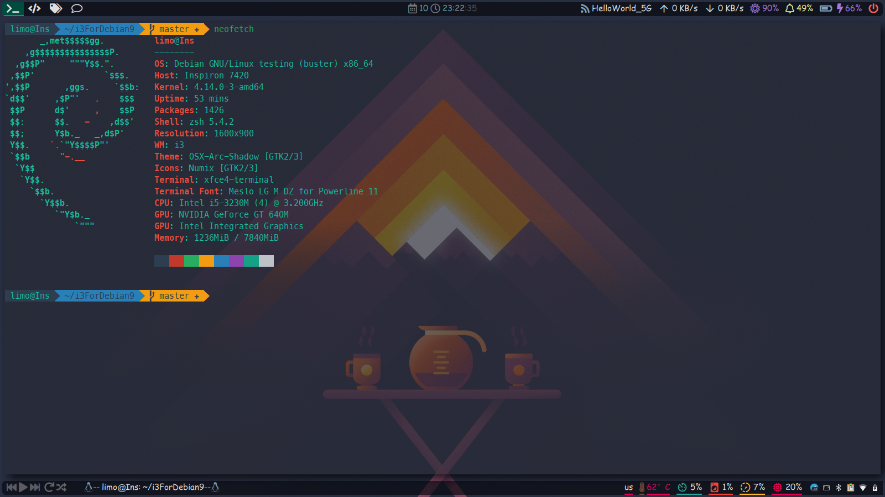
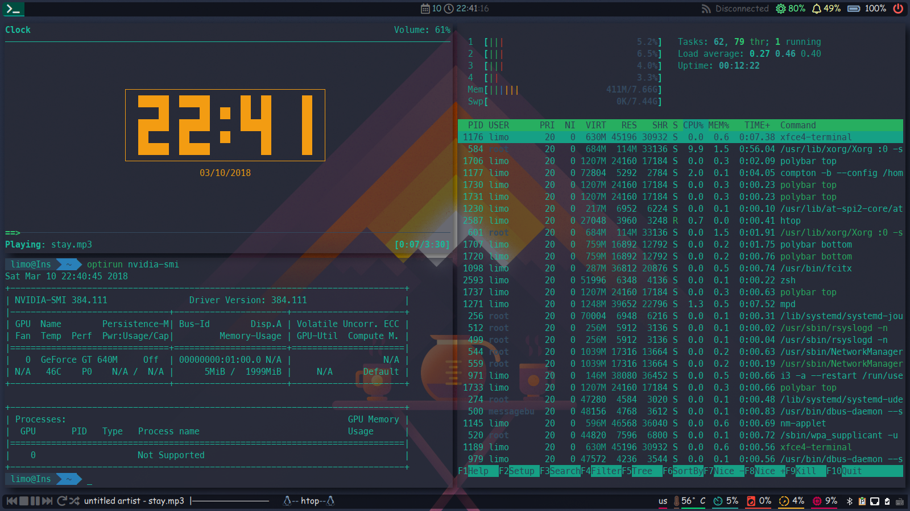
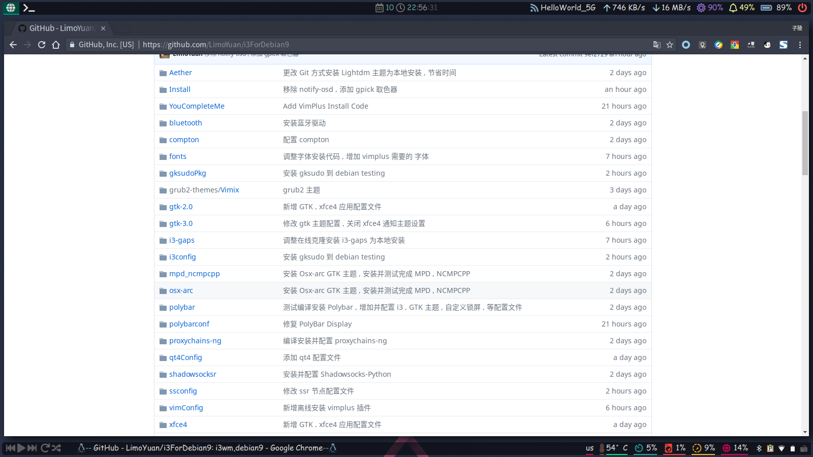
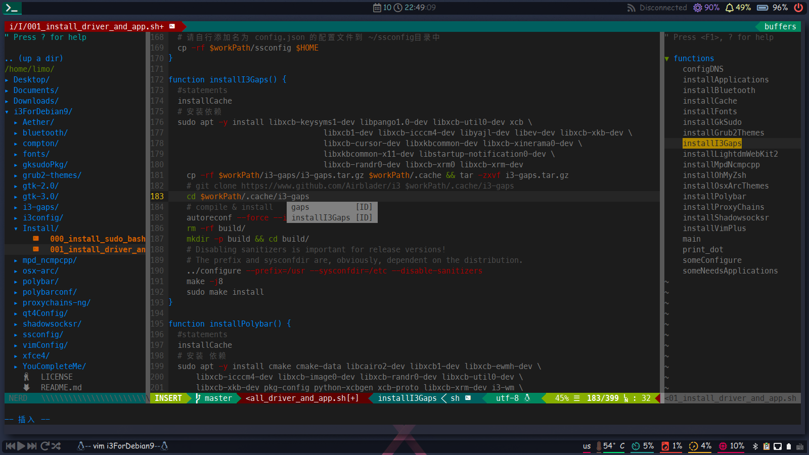
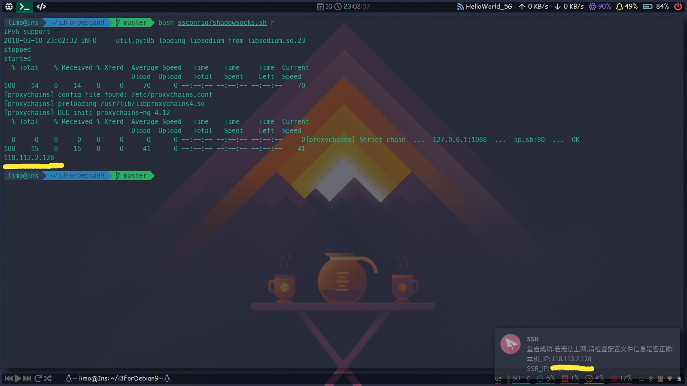
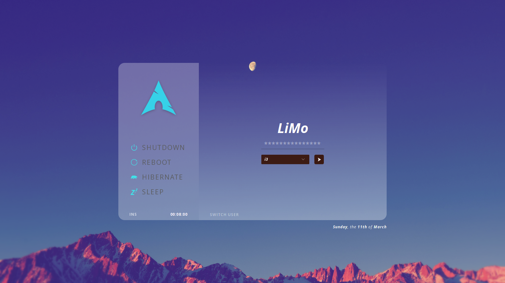

# i3 For Debian Buster 个人备份
------
- 新手, 代码很烂, 不过能跑(权当个人备份) ....
- `i3ForDebian9`已经**删除**, 不再更新.
- 一些软件是编译安装, 如: `i3-Gaps`,`polybar`,`YCM`故会花费更多的时间, 具体取决于你机器的配置. `i3Gaps`, `Polybar`在`Debian10`中暂无官方仓库安装途径.
------
## 安装方式

- 最小化安装 Debian10, [官方网络安装镜像](https://cdimage.debian.org/debian-cd/current/amd64/iso-cd/debian-10.0.0-amd64-netinst.iso)
- 安装完成后使用`root`用户登录`tty`, 放心, 它是安全的.
- 克隆该仓库到`tmp`目录

```sh
 git clone https://github.com/LimoYuan/i3ForDebianBuster /tmp
 cd /tmp/i3ForDebianBuster 
 bash install.sh 
 # 跑完后检查下是否有错误
 systemctl reboot
 bash ~/after_reboot.sh
```
- 脚本中安装的所有软件包都在`scripts/pkg`下
## i3wm 快捷键
| KeyMap | Action |
| :---: | :---: |
| Mod | Mod4(win) |
| Mod+Return | xfce-terminal |
| Mod+Tab | rofi window |
| Mod+d | rofi drun |
| Mod+F10 | SSR Start |
| Mod+F11 | SSR Stop |
| Mod+F12 | SSR Restart |
| Mod+ascfuiop90 | 1 - 10 工作区 |
| Mod+hjkl | 切换窗口快捷键(左下上右) |
| Mod+r (hjkl or up down left right) | 修改浮动窗口大小 |
| Mod+space | 切换到浮动窗口之后的窗口 |
| Mod+Shift+space | 切换窗口为浮动 / 退出浮动 |
| Mod+Shift+ascfuiop90| 移动当前窗口到其它工作区 |
| Mod+Shift+hjkl | 移动当前窗口在当前工作区中的位置 |
| Mod+Shift+d | rofi run |
| Mod+Shift+q | 自定义 rofi 电源按钮 |
| Mod+Shift+t | 重新加载 i3 配置文件 |
| Mod+Shift+r | 重启 i3wm |
| Mod+Control+k | 结束当前应用窗口|
| Mod+Control+h | 水平方向打开下一个窗口 |
| Mod+Control+v | 垂直方向打开下一个窗口 |
| Mod+Control+f | 切换当前窗口全屏 / 退出全屏 |
| Mod+Control+s | 切换窗口为折叠上下布局 |
| Mod+Control+z | 切换窗口为折叠左右布局 |
| Mod+Control+e | 切换窗口为split方式布局,也可用来退出前两种布局 |
| Mod+Control+l | dm-tool lock |
| Mod+Control+c | 自定义锁屏 |
| Mod+Control+t | Thunar |
| workspace_auto_back_and_forth | Mod+a,Mod+s;Mod+a/s 来回切换as工作区 |
### 关于Shadowsocksr_Python版, 以及Chrome SwitchOmega使用说明

- 安装成功后, 用户家目录下`ssconfig`中包含了一个`ssr`的`config.json`配置示例文件, 可以添加你自己的节点信息保存后使用`MOD+F12`重启SSR
- 对于国内用户, 没有vpn或者路由器翻跃长城的情况下, 此仓库包含了`SwitchOmega`, 请在chrome中打开`chrome://extensions`, 打开开发者模式, 将`SwitchyOmega_Chromium.crx`拖拽到chrome中修改配置即可; 或者使用`google-chrome --proxy-server=http://host:port`启动chrome, 在应用商店安装`SwitchyOmega`.

## 截图






------

## 该脚本使用到的一些程序和文件来自:
#### [i3Gaps](https://github.com/Airblader/i3)
#### [Polybar](https://github.com/jaagr/polybar)
~~[lightdm-webkit2-greeter](https://github.com/Antergos/web-greeter)~~
<br>
~~[lightdm-webkit2-greeter_Themes](https://github.com/NoiSek/Aether)~~
#### [Fonts_awesome](https://fontawesome.com/)
#### [Fonts_material-design-icons](https://github.com/google/material-design-icons)
#### [Fonts_Setting](https://ohmyarch.github.io/2017/01/15/Linux%E4%B8%8B%E7%BB%88%E6%9E%81%E5%AD%97%E4%BD%93%E9%85%8D%E7%BD%AE%E6%96%B9%E6%A1%88/)
~~[Grub_Themes](https://github.com/vinceliuice/grub2-themes)~~
#### [Shadowsocksr_python](https://github.com/shadowsocksr-backup/shadowsocksr)
#### [Proxychains-ng](https://github.com/rofl0r/proxychains-ng)
#### [Oh-My-Zsh](https://github.com/robbyrussell/oh-my-zsh)
#### [VimPlus](https://github.com/chxuan/vimplus)
#### [参考自这位`eoli3n`朋友的配置](https://github.com/eoli3n/dotfiles)
#### 诚谢以上项目, 可能还有其他没有列出, 之后再添加